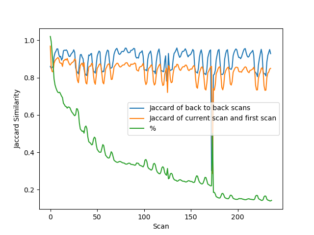
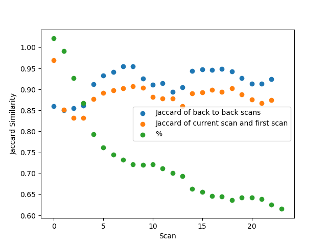
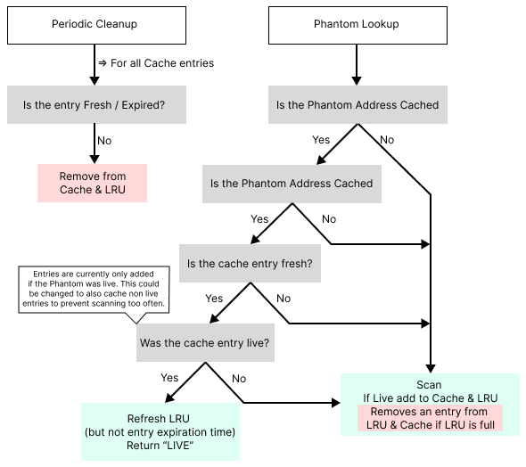

# Conjure Liveness Module

The liveness module is designed to keep track of all the live hosts in the
network by scanning the internet on a regular basis. The module provides cached
liveness detection and uncached liveness detection. Cached liveness detection
stores live hosts from previous `PhantomIsLive` calls to improve performance,
non-responsive hosts and stale cache entries are re-scanned each time. Uncached
liveness detection directly visits an IP address to check its liveness status on
each call.

The validity of cached liveness detection was tested in a week-long survey of
the internet where we measured the change in liveness across the network. We
observed a clear trend in the stability of discovered hosts over time and as
such chose a 2 hour default cache period.

## Usage

To check if an IP address is live in the network, call `PhantomIsLive(addr string, port uint16)` which return a bool and an error message if applicable.

## Network Survey Result

||
|:--:| 
| *Survey data for 3 weeks* |
||
| *Survey data for first 48 hours* |

Percentages of the number of current live hosts divided by the number of cached
live hosts(marked green) went down drastically in the first 24 hours of scanning
the network which indicates that caching every discoverable live hosts is not an
effective way to represent the current liveness status of the addresses in the
network over time. Instead, we decided to cache individual IP addresses that are passed to
`PhantomIsLive` for checking its liveness status. Every cached address gets a
timestamp when its liveness status is checked, cached addresses with expired
timestamp will no longer be considered as live hosts by the module. Expiration
duration can be set in the config file.

## Caching Flow Diagram

